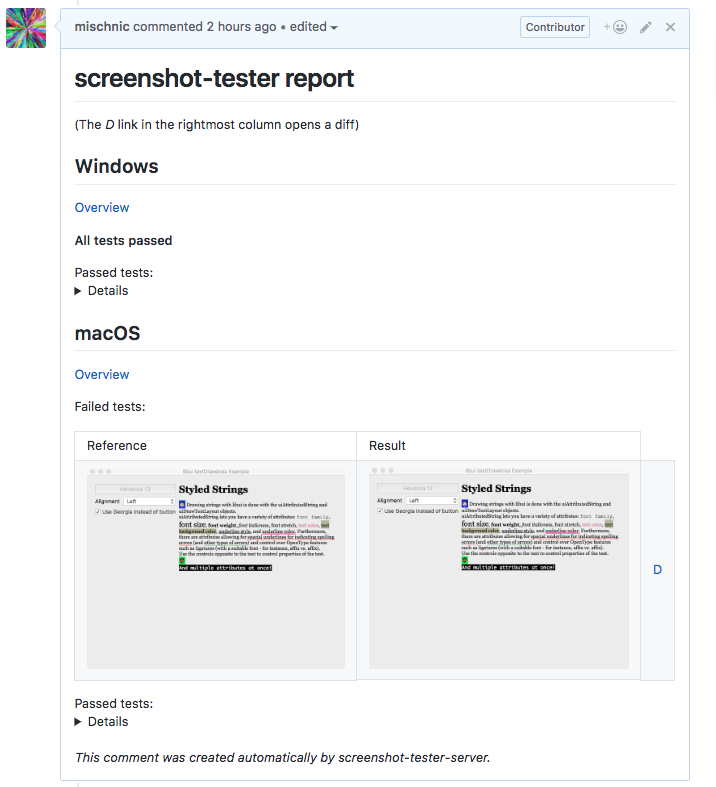

# screenshot-tester-server



A helper for [screenshot-tester](https://github.com/mischnic/screenshot-tester) which posts the results as a pull request comment.

## Architecture

```
                             ┌────────────────────────┐
                             │                        │
      ┌────────────────────> │     CI build service   │
      │                      │     (e.g. Travis)      │
      │                      │                        │
      │                      └─────────────┬──────────┘
      │                                    │
      │                                    │ Upload images & status
      │                                    │
      │                                    │
      │                                    v
┌─────┴────────┐              ┌───────────────────────────┐                 ┌──────────────────┐
│              │   Comment    │                           ├───────────────> │                  │
│    GitHub    │ <────────────│  screenshot-tester-server │   Images/Data   │ MongoDB Database │
│              │              │                           │ <───────────────┤                  │
└──────────────┘              └───────────────────────────┘                 └──────────────────┘

```

## Configuration 

Using environment variables:
- `DOMAIN`: The domain the server is hosted on (e.g. `https://example.com`)
- `DB_URL`: The URL of the MongoDB database (e.g. `mongodb://user:pw@example.com/db`)
- `GH_USER`: The user who issued the Github personal access token
- `GH_TOKEN` The Github personal access token

## Usage

- Via screenshot-tester's `pushToServer` function.

- Manually using curl:
```sh
# -F "area-adv:temp/area-adv.js_diff.png:diff=@temp/area-adv.js_diff.png" \
#      test   :destination              :type=@file to upload

curl \
-F ":index.html:=@index.html" \
-F "area-adv:reference/darwin/area-adv.js.png:ref=@reference/darwin/area-adv.js.png" \
-F "area-adv:temp/area-adv.js.png:res=@temp/area-adv.js.png" \
-F "area-adv:temp/area-adv.js_diff.png:diff=@temp/area-adv.js_diff.png" \
-F "forms:reference/darwin/forms.js.png:ref=@reference/darwin/forms.js.png" \
-F "forms:temp/forms.js.png:res=@temp/forms.js.png" \
-F "forms:temp/forms.js_diff.png:diff=@temp/forms.js_diff.png" \
-F "grid:reference/darwin/grid.js.png:ref=@reference/darwin/grid.js.png" \
-F "grid:temp/grid.js.png:res=@temp/grid.js.png" \
-F "grid:temp/grid.js_diff.png:diff=@temp/grid.js_diff.png" \
-F "node-pad:reference/darwin/node-pad.js.png:ref=@reference/darwin/node-pad.js.png" \
-F "node-pad:temp/node-pad.js.png:res=@temp/node-pad.js.png" \
-F "node-pad:temp/node-pad.js_diff.png:diff=@temp/node-pad.js_diff.png" \
-F "text:reference/darwin/text.js.png:ref=@reference/darwin/text.js.png" \
-F "text:temp/text.js.png:res=@temp/text.js.png" \
-F "text:temp/text.js_diff.png:diff=@temp/text.js_diff.png" \
'https://example.org/owner/test_repo/pr_number?failed=text&failed=grid&os=darwin'
```

## Exposed URLs / "API"

- **POST**: `https://host.com/[owner]/[repo]/[issue]?os=darwin&failed=my_test`

Create (or update) a comment in the `owner/repo` repository and pull request no. `issue`. Files are to be sent in a form (curl example above) with the keys indicating the file type and destination path:
```js
      await request.post({
        url: host + "/" + repoId + "/" + issue,
        qs: {
          os: "darwin"
          failed: ["my_test"]
        },
        formData: {
          ":index.html:": : fs.createReadStream("tests/output/index.html"),
          "area-adv:reference/darwin/area-adv.js.png:ref": fs.createReadStream("tests/output/reference/darwin/area-adv.js.png")
        }
      });
```

- **GET**: `https://host.com/[owner]/[repo]/[issue]/[some hash (hex)]/[os]/path/to/file.ext`

Get a file uploaded previously.

- **POST**: `https://host.com/cleanup`

Cleans up the database (removes data from deleted comments).